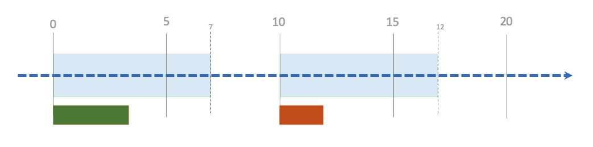
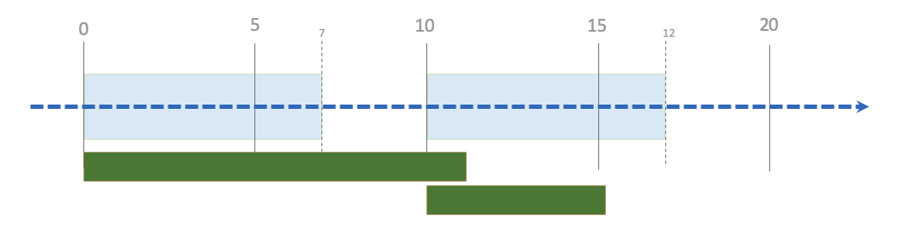
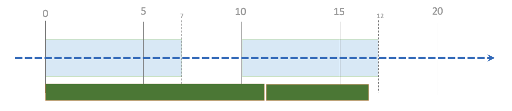
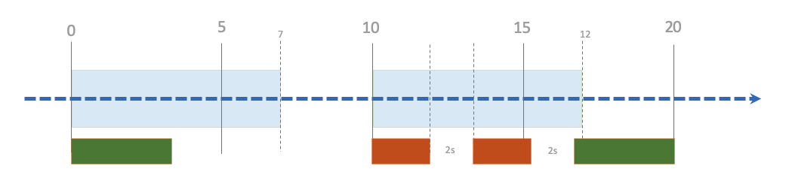
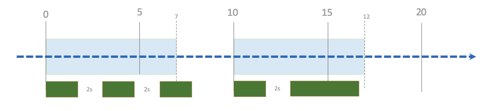
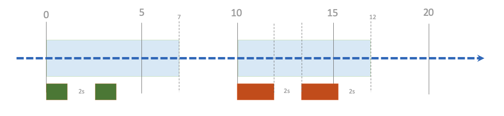
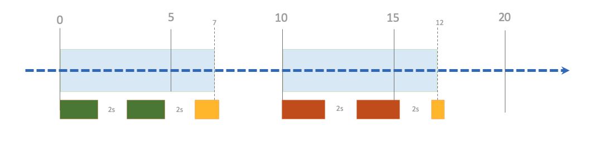
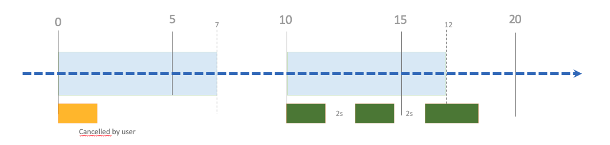

# RMS Scheduler plugin
A rule based scheduler embedding drools.

# What can this plugin do for you ?

Using this plugin, you will be able to define runtime schedule policies onto your topology. 
Final goal is to launch workflows during scheduled time windows, and eventually condition these launches using complex event processing rules.

How it works in few words:
- A runtime policy `RMSScheduleWorkflowPolicy` is defined in the embedded [csar](src/main/resources/csar/tosca.yml).
- This policy let you define a schedule time window. Inside this time window, you workflow can be launched if it's conditions are met.
- Conditions are expressed using a DSL that admin can enrich.

Without conditions, it will act as a runtime scheduler that will just schedule workflows with smart features :
- You can retry if a workflow fail.
- You can loop a successful job during the time window.
- You can define the delay between retries or repeat.
- You can define the maximum of triggers inside the time window.
- You can cancel the execution when time window expires in order to ensure no activity outside defined periods.

# Config

This plugin can be tuned by setting following properties in A4C YAML configuration 
(prefix is `alien4cloud-rms-scheduler-plugin`) :

Property name | default | description 
------------ | -------------| -------------
metricEventTtl | 10m | The TTL for events : you should set this config regarding to the frequency with witch you expect to receive events in your loopback.
heartbeatPeriod | 60 | In seconds, the period between 2 rule fires. A heartbeat will fire all rules on each session (1 session per active deployments).

For tests purposes you should reduce `heartbeatPeriod` in order to make the system more reactive.

```
alien4cloud-rms-scheduler-plugin:
  metricEventTtl: 10m
  heartbeatPeriod: 1
```

# How-to

Add the **RMS Scheduler Modifier** to your location at **post-policy-match** phase.
Create a topology using simple mocks and add one or several **RMSScheduleWorkflowPolicy** to your topology (or use [this one](src/test/resources/csar/sample.yml)).

The following policy config example will :
- trigger the run workflow (you need a run workflow !) each hour at 0 and 30 minutes.
- if workflow fails, it will be retried maximum 2 times (during the window time of 10 minutes).
- each retry will be delayed of 1 minute

## Examples

Property name | value
------------ | -------------
cron_expression | 0 0/30 * * * ?
timer_type | cron
workflow_name | run
duration | 10m
retry_on_error | true
max_run | 3
delay | 1m

This other example will trigger run workflow after a 10 minutes delay (after the deployment, or system start), if conditions are satisfied (with temporal window of 2 minutes) :

Property name | value
------------ | -------------
cron_expression | 10m
timer_type | int
workflow_name | run
duration | 2m
conditions[0] | I've got a recent value for metric "ES_Disk_Free"
conditions[1] | Last known metric "ES_Disk_Free" is >= 10000

Condition are :
- **ES_Disk_Free** metrics exists in the system
- **ES_Disk_Free >= 10000** (let's say it's Go so 10 To)

You can publish an event of type **ES_Disk_Free** using the following REST query :
```
curl -X PUT http://localhost:8088/rest/rmsscheduler/events/publish/ES_Disk_Free/20000
```

Events are timestamped and have a TTL of 5m (TODO: make plugin configurable)

Another example condition could also be `Average value for metric "ES_Disk_Free" during last 10m is > 10000`.

In the example policy configuration below, if conditions are met, the policy will loop during 3m, with a delay between each triggers of 45s. 
 :

```
timer_type: cron
cron_expression: "0 0/5 * * * ?"
duration: 3m
loop: true
delay: 45s
only_one_running: true
conditions: 
 - "Average value for metric \"ES_Disk_Free\" during last 10m is > 10000"
workflow_name: run
```

## Scheduler features illustrations

`cron_expression` and `duration` let you define the schedule time window :

```
cron_expression: 0 0/10 * * * ?
duration: 7m
```



By default, runs can overlap (if the run duration exceed the time window) :

```
cron_expression: 0 0/10 * * * ?
duration: 7m
only_one_running: false (default)
```



You can change this behavior by using `only_one_running` :
```
cron_expression: 0 0/10 * * * ?
duration: 7m
only_one_running: true
```



The second run is launched after the first terminates (without delay).

You may want to retry on error :

```
cron_expression: 0 0/10 * * * ?
duration: 7m
retry_on_error: true
delay: 2s
```



You may want to `loop` the execution even if run succeed :

```
cron_expression: 0 0/10 * * * ?
duration: 7m
loop: true
delay: 2s
```



You can limit the number of runs using `max_run` :

```
cron_expression: 0 0/10 * * * ?
duration: 7m
retry_on_error: true
loop: true
max_run: 2
delay: 2s
```



Execution can be cancelled by the rule itself if time window expires :

```
cron_expression: 0 0/10 * * * ?
duration: 7m
loop: true
retry_on_error: true
delay: 2s
cancel_on_timeout: true
```



When cancelled by user, the executions in current time window are canceled. Next occurrences will be triggered as usual :

```
cron_expression: 0 0/10 * * * ?
duration: 7m
loop: true
delay: 2s
```



When a scheduled workflow is cancelled, all subsequent executions (linked to a given trigger) will not be triggered. But the next trigger will be scheduled.

# TODO

- Validate the whole rule (including timer expressions)
- DSL editor
- Manage deployment update
- Manage downtime ? 
- Manage workflow inputs

## Ideas


