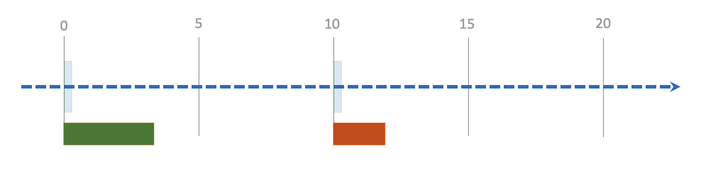
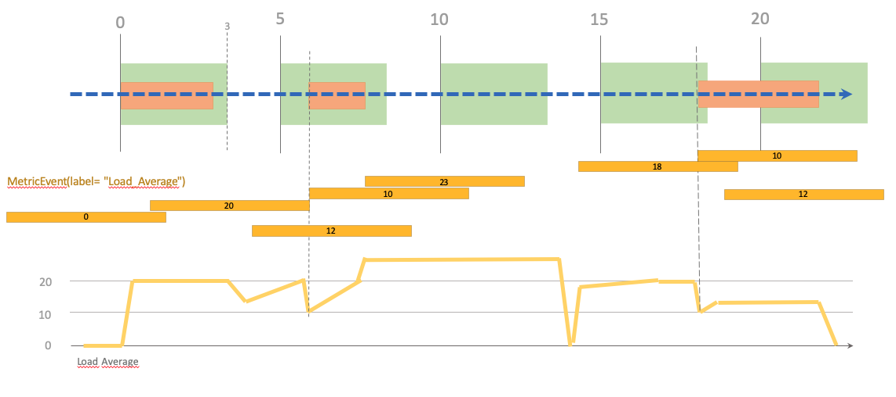

# RMS Scheduler plugin
A rule based scheduler embedding drools.

# What can this plugin do for you ?

Using this plugin, you will be able to define runtime schedule policies onto your topology. 
Final goal is to launch workflows during scheduled time windows, and eventually condition these launches using complex event processing rules.

How it works in few words:
- A runtime policy `RMSScheduleWorkflowPolicy` is defined in the embedded [csar](src/main/resources/csar/tosca.yml).
- This policy let you define a schedule time window. Inside this time window, you workflow can be launched if it's conditions are met.
- Conditions are expressed using a DSL that admin can enrich.

Without conditions, it will act as a runtime scheduler that will just schedule workflows with smart features :
- You can retry if a workflow fail.
- You can loop a successful job during the time window.
- You can define the delay between retries or repeat.
- You can define the maximum of triggers inside the time window.
- You can cancel the execution when time window expires in order to ensure no activity outside defined periods.

# Config

This plugin can be tuned by setting following properties in A4C YAML configuration 
(prefix is `alien4cloud-rms-scheduler-plugin`) :

Property name | default | description 
------------ | -------------| -------------
metricEventTtl | 10m | The TTL for events : you should set this config regarding to the frequency with witch you expect to receive events in your loopback.
heartbeatPeriod | 60000 | In milliseconds, the period between 2 rule fires. A heartbeat will fire all rules on each session (1 session per active deployments).

For tests purposes you should reduce `heartbeatPeriod` in order to make the system more reactive.

```
alien4cloud-rms-scheduler-plugin:
  metricEventTtl: 10m
  heartbeatPeriod: 500
```

# How-to

Add the **RMS Scheduler Modifier** to your location at **post-policy-match** phase.
Create a topology using simple mocks and add one or several **RMSScheduleWorkflowPolicy** to your topology (or use [this one](src/test/resources/csar/sample.yml)).

The following policy config example will :
- trigger the run workflow (you need a run workflow !) each hour at 0 and 30 minutes.
- if workflow fails, it will be retried maximum 2 times (during the window time of 10 minutes).
- each retry will be delayed of 1 minute

## Examples

Property name | value
------------ | -------------
cron_expression | 0 0/30 * * * ?
timer_type | cron
workflow_name | run
duration | 10m
retry_on_error | true
max_run | 3
delay | 1m

This other example will trigger run workflow after a 10 minutes delay (after the deployment, or system start), if conditions are satisfied (with temporal window of 2 minutes) :

Property name | value
------------ | -------------
cron_expression | 10m
timer_type | int
workflow_name | run
duration | 2m
conditions[0] | I've got a recent value for metric "ES_Disk_Free"
conditions[1] | Last known metric "ES_Disk_Free" is >= 10000

Condition are :
- **ES_Disk_Free** metrics exists in the system
- **ES_Disk_Free >= 10000** (let's say it's Go so 10 To)

You can publish an event of type **ES_Disk_Free** using the following REST query :
```
curl -X PUT http://localhost:8088/rest/rmsscheduler/events/publish/ES_Disk_Free/20000
```

Events are timestamped and have a TTL of 5m (TODO: make plugin configurable)

Another example condition could also be `Average value for metric "ES_Disk_Free" during last 10m is > 10000`.

In the example policy configuration below, if conditions are met, the policy will loop during 3m, with a delay between each triggers of 45s. 
 :

```
timer_type: cron
cron_expression: "0 0/5 * * * ?"
duration: 3m
loop: true
delay: 45s
only_one_running: true
conditions: 
 - "Average value for metric \"ES_Disk_Free\" during last 10m is > 10000"
workflow_name: run
```

## Scheduler features (illustrated by examples)

`cron_expression` and `duration` let you define the schedule time window :

```
cron_expression: 0 0/10 * * * ?
duration: 7m
```


In the example above, the first run at HH:00 was successful, but failed at HH:10.

By default, runs can overlap (if the run duration exceed the time window) :

```
cron_expression: 0 0/10 * * * ?
duration: 7m
only_one_running: false (default)
```


You can change this behavior by using `only_one_running` :
```
cron_expression: 0 0/10 * * * ?
duration: 7m
only_one_running: true
```


The second run is launched after the first terminates (without delay).

You may want to retry on error :

```
cron_expression: 0 0/10 * * * ?
duration: 7m
retry_on_error: true
delay: 2s
```


You may want to `loop` the execution even if run succeed :

```
cron_expression: 0 0/10 * * * ?
duration: 7m
loop: true
delay: 2s
```


You can limit the number of runs using `max_run` :

```
cron_expression: 0 0/10 * * * ?
duration: 7m
retry_on_error: true
loop: true
max_run: 2
delay: 2s
```


A 0s time window means the trigger will execute once (loop or retry_on_error is uneffective)

```
cron_expression: 0 0/10 * * * ?
duration: 0s
retry_on_error: true
loop: true
```



Execution can be cancelled by the rule itself if time window expires :

```
cron_expression: 0 0/10 * * * ?
duration: 7m
loop: true
retry_on_error: true
delay: 2s
cancel_on_timeout: true
```


When cancelled by user, the executions in current time window are canceled. Next occurrences will be triggered as usual :

```
cron_expression: 0 0/10 * * * ?
duration: 7m
loop: true
delay: 2s
```


When a scheduled workflow is cancelled, all subsequent executions (linked to a given trigger) will not be triggered. But the next trigger will be scheduled.

## Conditions & CEP (illustrated by examples)

The most interesting feature of this plugin is the ability to add conditions to your rules. 
Once a time window has been defined for a trigger (using the schedule properties of the policy), the action (launch a workflow) is conditioned by the conditions of the policy.

Basically, aims of conditions is to evaluate events of type [MetricEvent](src/main/java/org/alien4cloud/rmsscheduler/model/MetricEvent.java).
A MetricEvent is something with a name, a value and a date (events are timestamped). An event represents a measure of the health of your system at a given date.

Conditions are expressed using sentences that are builtin with the plugin. At this time, the following sentences are available :

- I've got a recent value for metric "**{metric_label}**"
- Last known metric "**{metric_label}**" is **{operator}** **{metric_value}**
- Average value for metric "**{metric_label}**" during last **{window_time}** is **{operator}** **{metric_value}**

Where

variable name | description | examples
------------ | ------------- | -------------
metric_label | The name of the metric event to consider | Load_Average, Disk_Free
operator | The comparison operator | \> < >= <= == !=
metric_value | The value of the metric to consider | 5, 15000
window_time | The window time to consider | 10m 5s 1m30s

Few examples :
- _Last known metric "Load_Average" is < 10_ : the workflow will be launched during the time window only if the last value for metric Load_Average is < 10.
- _Average value for metric "Disk_Free" during last 10m is >= 10000_ : the workflow will be launched during the time window only if the average value for metric Disk_Free is >= 10000 during the last 10 minutes.

Obviously, **metric_label** and **metric_value** depend on how you measure your system health. 
You will need to use provided or write your own sensor plugin in order to publish events in the system.

Let's take an example : Imagine you have a single sensor that measure the load average of an external system (whatever you want: a database, a kubernetes cluster ...). 
Regularly, you inject a timestamped event that represents the load average of this system in the rule engine.

You have defined a policy on your topology that is configured like this :

```
cron_expression: 0 0/5 * * * ?
duration: 3m
only_one_running: true
conditions:
    - I've got a recent value for metric "Load_Average"
    - Last known metric "Load_Average" is <= 10
```



The graph at the bottom represents the real system load average. Your sensor will not absolutely give you measures in real time (maybe it's a scheduled process that poll measures regularly, or events are coming in a Kafka topic).
Metric events that are given to the rule engine are represented at the middle of the schema.
So what's happened ?
- at T 00:00:00 we have already received a metric that satisfy our rule (load average is 0, system is sleeping), the workflow is launched.
- at T 00:01:00 we receive an event with value 20 (our workflow is running, maybe it's the consequence of this).
- at T 00:02:30 the workflow ends. The load average decrease. 
- at T 00:03:30 antoher process, not managed by us is loading the system, the load average increase. 
- at T 00:04:00 we receive an event with value 12 
- at T 00:05:00 a new time window for the trigger is available. But the condition is not satisfied : the workflow is not launched.
- at T 00:06:00 we receive an event with value 10. The workflow is launched.
- at T 00:07:30 we receive an event with value 23. 
- at T 00:10:00 a new window is available, but the condition is not satisfied (our last known load average is 23). The workflow will never be launched during this time window since condition is never met.
- at T 00:15:00 a new window is available, but the condition is not satisfied (our last known load average is 18).
- at T 00:17:30 we receive a event with value 10. The workflow is launched.
- This time the workflow take more time to do it's job and go outside the time window. The time window starting at 00:20:00 will not trigger the launch since it's already running.

It's important to understand that events have a TTL (defined in the plugin configuration). They expire so disappear from the system after this TTL is expired.

# TODO

- DSL editor
- Manage deployment update
- Manage downtime ? 
- Manage workflow inputs

## Ideas


